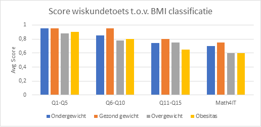
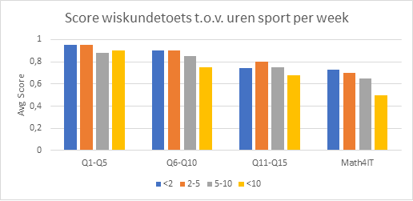
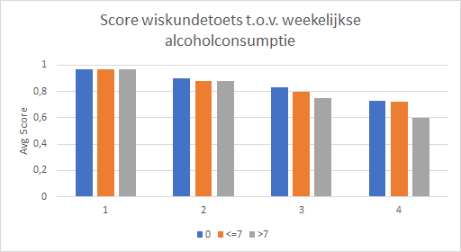
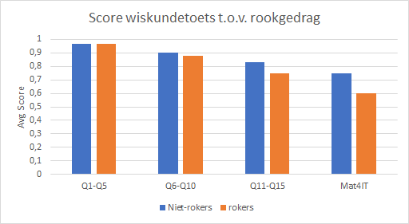

# Hypothese

## Onderzoeksvraag
We verwachten dat er een relatie is tussen de fysieke gezondheid van een persoon en zijn wiskundige geletterdheid. We veronderstellen dat bij een betere fysieke gezondheid de wiskundige geletterdheid ook hoger zal zijn.
Meer specifiek kijken we naar twee factoren die gelinkt kunnen worden aan de fysieke gezondheid, namelijk middelengebruik en de algemene lichamelijke paraatheid.

<ol>
    <li>
    Bestaat er een verband tussen middelen-gebruik of -misbruik (alcohol, roken) en wiskundige geletterdheid? Wat is de impact van het gebruik op de resultaten die behaald werden door tweedejaarsstudenten Toegepaste Informatica aan HoGent? De wiskundige geletterdheid werd gemeten op het niveau van het lager onderwijs tot en met het niveau van het eerste jaar hoger onderwijs.
    </li>
    <li>
    Bestaat er een verband tussen het gemiddelde aantal uren sport per week, de BMI en Wiskundige geletterdheid? Wat is de impact van het aantal uren sporten en de BMI op de resultaten die behaald werden door tweedejaarsstudenten Toegepaste Informatica aan Hogent? De wiskundige geletterdheid werd gemeten op het niveau van het lager onderwijs tot en met het niveau van het eerste jaar hoger onderwijs.
    </li>
</ol>

## Toelichting
Onze onderzoeksvraag handelt over de invloed van fysieke gezondheid op wiskundige geletterdheid. Wij vermoeden dat fysiologische invloeden van een gezonde levensstijl een positief effect zullen hebben op cognitieve processen, zoals wiskundig inzicht. De onafhankelijke variabelen die wij zullen bestuderen zijn enerzijds lichaamscomposities, die een indicatie kunnen geven over de algemene gezondheid: grootte en gewicht geeft een BMI, wat een ruwe inschatting geeft over lichaamscompositie. Anderzijds zullen we rekening houden met variabelen die indirect geassocieërd worden met gezondheid: alcoholconsumptie, roken etc. Tot slot kijken we naar een set van variabelen die inzicht geven over de graad van fysieke activiteit: tijd gespendeerd in sportclub, aantal uren gemiddeld gesport etc. Zoals reeds vernoemd, vermoeden we dat deze variabelen gecorreleerd zijn met wiskundige geletterdheid door het gunstige effect van gezondheid op het cognitieve proces. De eerste artikels die we hebben gevonden, geven ons reeds een aanzet naar een conclusie in die richting. Zo lijkt er reeds een verband te zijn tussen sport en academisch succes.

> The improvement in math performance in the integrated PA group was significantly larger compared to that of the control group. Perceived competence for math remained high and stable over time in both groups. _(Spyridoula Vazou & Miriam A.B. Skrade, 2014, "Math performance, perceived competence, and need satisfaction", https://www.tandfonline.com/doi/abs/10.1080/1612197X.2016.1164226 )_

Ook is er al een verband gelegd tussen alcoholgebruik en academische capaciteit. In dit onderzoek beperken we ons enkel tot de huidige staat van gezondheid, en niet op historische gegevens van de ondervraagden.

## Selectie variabelen

Onafhankelijke:
<ul>
<li>LengthCm</li>
<li>WeightKG</li>
<li>AlcoholConsumption</li>
<li>CigaretteConsumption</li>
<li>RankSportsClub</li>
<li>SportsHours</li>
</ul>
Afhankelijke:
<ul>
<li>TestQ01-TestQ05</li>
<li>TestQ06-testQ10</li>
<li>TestQ11-TestQ15</li>
<li>GradeMath4IT</li>
</ul>

## Schets verwachte resultaten

## Bronnen

### BMI

_Beyond Body Mass Index - Voordelen en tekortkomingen BMI_\
https://doi.org/10.1046/j.1467-789x.2001.00031.x

---

_Relationships Between the Body Mass Index and Body Composition_\
https://doi.org/10.1002/j.1550-8528.1996.tb00510.x

-> BMI maakt in de noemer (gewicht) geen onderscheid tussen spieren, vetweefsel, beenderen en organen. Moeilijker om een onderscheid te maken tussen gezond en ongezond? In het achterhoofd houden bij het bespreken van de analyse later

---

### Physical Activity

_Student academic performance outcomes of a classroom physical activity ıntervention: A pilot study_ (6 - 11 jaar)
https://www.iejee.com/index.php/IEJEE/article/view/191

---

_Relationships of Physical Activity to Brain Health and the Academic Performance of Schoolchildren_\
https://www.researchgate.net/publication/228351606_Relationships_of_Physical_Activity_to_Brain_Health_and_the_Academic_Performance_of_Schoolchildren

> In a review of the literature, Trudeau and Shephard (2010) identified physiological influences such as greater arousal and enhanced levels of neurotrophins that stimulate neural connections in the hippocampus or learning center of children’s brains. Further, additional psychosocial influences were also found in the literature, including an increased level of self-esteem and connectedness in schools, likely enhancing children’s ability to learn (Trudeau & Shephard, 2010)

Trudeau, F. & Shephard, R.J. (2010). Relationships of physical activity to brain health and the academic performance of schoolchildren. American Journal of Lifestyle Medicine, 4, 138-150.

---

_The Importance of Physical Activity and Physical Education in the Prediction of Academic Achievement_\
https://www.cabdirect.org/cabdirect/abstract/20083299880

> Physical activity was significantly and positively related to both mathematics and reading achievement in boys and girls. Physical education participation was _not_ significantly related to achievement.

---

_Can Academic Success Come from Five Minutes of Physical Activity?_\
https://www.researchgate.net/deref/http%3A%2F%2Fdx.doi.org%2F10.26522%2Fbrocked.v13i1.40

> Being physically active helps not only in the areas of health and fitness, but also in the area of academics, more specifically, mathematics.

> First, although there was a small positive effect on math fluency, there was no negative effect. Second, positive changes in students' behavior were noted by the classroom teacher.

---

_What Is the Impact of Exercise on Brain Function for Academic Learning._\
https://eric.ed.gov/?id=EJ630329

> compared the mental performance of students who were involved in regular continuous activity to that of a group of inactive students and found that physically active students performed significantly better on mathematics tests. (SM)

### Alcohol en Roken

_Academic Achievement and Adolescent Drug Use: An Examination of Reciprocal Effects and Correlated Growth Trajectories_

> Growth trajectories of school achievement and drug use over the course of junior high were highly correlated. Students who demonstrated deteriorating achievement during the course of junior high school showed an increase in drug use during this same time frame.

Henry, K. L. (2010). Academic Achievement and Adolescent Drug Use: An Examination of Reciprocal Effects and Correlated Growth Trajectories. Journal of School Health, 80(1), 38–43. doi:10.1111/j.1746-1561.2009.00455.x

---

_The Education-Drug Use Connection: How Successes and Failures in School Relate to Adolescent Smoking, Drinking, Drug Use, and Delinquency_\
https://eric.ed.gov/?id=ED528939

> In Adolescence, Substance Use Is Negatively Linked With Educational Success. All four substances studied here—tobacco (cigarettes), marijuana, cocaine, and alcohol—are more likely to be used by adolescents who are not doing especially well in school and who are less likely than average to enter or complete college during their postadolescent years

---

_Relationship Between Physical Fitness and Academic Performance_\
Karen Rodenroth https://digitalcommons.liberty.edu/cgi/viewcontent.cgi?article=1377&context=doctoral

> The females from the study who participated in physical education for seventy or more minutes per week had significantly higher achievement scores in mathematics.

---

_The effects of alcohol use on academic achievement in high school_

> We find that increases in alcohol consumption result in small yet statistically significant reductions in GPA for male students and in statistically non-significant changes for females.

Ana I. Balsa, Laura M. Giuliano, Michael T. French https://www.ncbi.nlm.nih.gov/pmc/articles/PMC3026599/

### Andere

_Weight, socio-demographics, and health behaviour related correlates of academic performance in first year university students_

> This study, conducted in Belgian first year university students, showed that academic performance is associated with a wide range of weight and health related behaviours. Future studies should investigate whether interventions aiming at promoting healthy behaviours among students could also have a positive impact on academic performance.

Tom Deliens, Peter Clarys, Ilse De Bourdeaudhuij and Benedicte Deforche https://lib.ugent.be/en/catalog/pug01:4266181?i=0&q=health+students+grade
